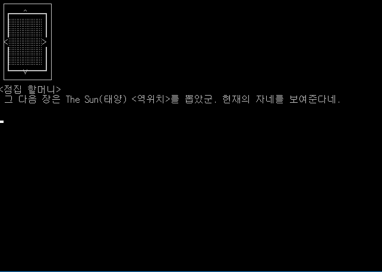
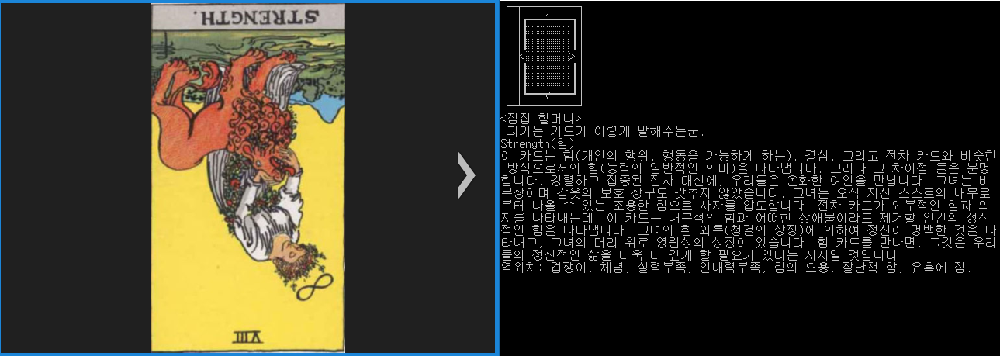

# tarotkr.py

tarotkr은 한국어 타로 카드를 시뮬레이팅하는 것을 목적으로 만들어진 모듈입니다. 메이저 아르카나(22장)과 마이너 아르카나(78장)이 모두 구현되어 있으며, 정방향과 역방향에도 대응합니다. `tarotkr.py`와 같은 폴더 안에 있는`tarotcards.json` 에서 데이터를 읽어옵니다.

json 데이터는 온라인 상에서 돌아다니는 [Universal Waite tarot deck](https://en.wikipedia.org/wiki/Universal_Waite_tarot_deck)을 설명하는 자료를 기반으로 하여 만들었습니다.

### 어떻게 사용하면 되나?

```python
>>> import tarotkr
```

먼저 tarotkr을 import 해줍니다. tarotkr은 특정 타로 카드에 대한 설명 보기를 제외하곤 카드 덱을 만들고, 카드 덱으로부터 기능을 실행하도록 되어있습니다.

```python
>>> tdeck = tarotkr.TarotDeck()
```

혹은

```python
>>> tdeck = tarotkr.TarotDeck(False)
```

같은 식으로 만들 수도 있습니다. 기본적으로는 메이저 아르카나(22장)으로 덱이 만들어지지만, 아래와 같이 인자로 `False`를 줄 경우엔 마이너 아르카나(78장)으로 덱이 생성됩니다. 생성된 덱은 아래와 같이 사용할 수 있습니다.

```python
card = tdeck.draw()
# 카드는 이런 식으로 뽑을 수 있습니다. 기본적으론 정방향으로 22장이 순서대로 배열되어 있습니다.
# 따라서 무조건 아르카나 21번 세계(The World)가 뽑힙니다.

tdeck.shuffle()
# 덱을 섞습니다. 정,역방향과 카드 배열 순서가 무작위로 섞이게 됩니다.

string = tdeck.cardDesc(card, option='nameonly')
# cardDesc는 카드의 정보를 문자열로 반환하는 메소드입니다. 
# option 값은 'nameonly(이름만)'가 default 값입니다. 
# option 파라미터는 'simple(간단 설명)', 'detail(상세 설명)'이 존재합니다.

string = tdeck.cardImg(card, size='small', showback=False)
# cardImg는 해당 카드에 대응하는 src 폴더의 카드 이미지 주소를 문자열로 반환하는 메소드입니다. 
# size의 파라미터는 'small(작은 카드)', 'big(큰 카드)'가 있습니다.
# showback 파라미터는 True일 시 앞면 이미지를 무시하고 뒷면만을 반환합니다. 
# 뒤의 파라미터 둘은 default로 설정 되어있습니다.

string = tarotkr.tarotDetail('세계', option='desc', imgpath=False)
# 카드에 대한 정보를 찾아주는 함수입니다. 
# 역시 option의 'desc'와 imgpath의 'False'는 default로 설정 되어 있습니다. 
# option의 파라미터는 'desc(상세 설명)', 'tpos(정위치만 설명)', 'rpos(역위치만 설명)' 이렇게 있습니다. 
# imgpath는 True일시 카드 이미지 주소도 반환합니다. 결과는 ['정보', '이미지 주소']의 형태로 리스트로 반환됩니다.
```

`tarotkr.py`의 실행에는 `src` 폴더 내부의 타로 카드 이미지가 저장된 `tarotimg` 폴더와 데이터가 저장된 `tarotcards.json` 파일만이 필요합니다. 나머지 파일들은 실행에는 사용되지 않습니다.

### 예제

`dist` 폴더의 `example.exe` 파일은 `src`폴더의 `example.py`를 빌드한 것입니다.  가장 대중적인 쓰리카드 스프레드를 이용했습니다. 콘솔로 만들어진 프로그램이라 이미지 출력 기능은 따로 없습니다. 이미지 파일은 컴퓨터에 설치된 이미지 뷰어를 통해 열립니다.





